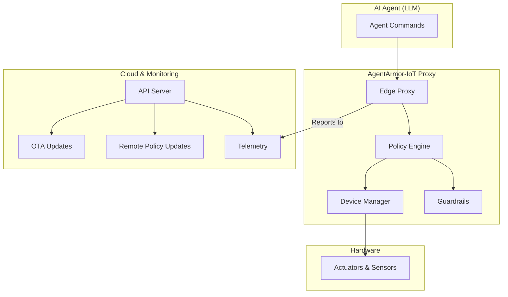

# AgentArmor-IoT

AgentArmor-IoT is an ultra-lightweight, edge-optimized physical safety proxy for embodied AI. It is designed to sit between an AI agent and the physical hardware it controls, intercepting commands and ensuring they are safe before execution.

## Architecture

The following diagram illustrates the architecture of the AgentArmor-IoT proxy:



### Components

*   **Edge Proxy:** The main entry point for incoming AI agent commands. It coordinates the evaluation of commands with the policy engine and the device manager.
*   **Policy Engine:** The core of the proxy. It enforces the loaded guardrails against the current system state and the proposed action from the agent.
*   **Guardrails:** A set of safety rules that define the operational boundaries of the system. Examples include velocity constraints, physics violation checks, and anomaly detection.
*   **Device Manager:** A hardware abstraction layer (HAL) that provides a consistent interface for interacting with various hardware devices (actuators, sensors).
*   **API Server:** An embedded web server that exposes endpoints for:
    *   **Telemetry:** Exporting metrics for monitoring.
    *   **Remote Policy Updates:** Allowing for dynamic updates of the safety policy.
    *   **OTA Updates:** Enabling over-the-air firmware updates.

## Modules

*   `main.rs`: The main entry point of the application.
*   `lib.rs`: The main library crate, which declares all the modules.
*   `edge_proxy.rs`: Implements the `EdgeProxy` component.
*   `policy.rs`: Defines the core policy engine, `AgentArmorEdge`.
*   `guardrails.rs`: Contains the implementation of the various safety guardrails.
*   `hal.rs`: Defines the Hardware Abstraction Layer traits.
*   `device_manager.rs`: Implements the `DeviceManager` for managing hardware devices.
*   `policy_config.rs`: Defines the structure of the policy configuration.
*   `remote_policy.rs`: Implements the remote policy update functionality.
*   `ota_update.rs`: Implements the OTA update functionality.
*   `telemetry.rs`: Sets up and exposes the telemetry metrics.
*   `red_team.rs`: A harness for on-device red-teaming and diagnostics.
*   `ml_anomaly_guardrail.rs`: A guardrail for detecting anomalies using machine learning.

## Getting Started

### Prerequisites

*   Rust (latest stable version)

### Building

To build the project, run the following command:

```sh
cargo build --release
```

### Running Tests

To run the test suite, use the following command:

```sh
cargo test --all-targets
```
